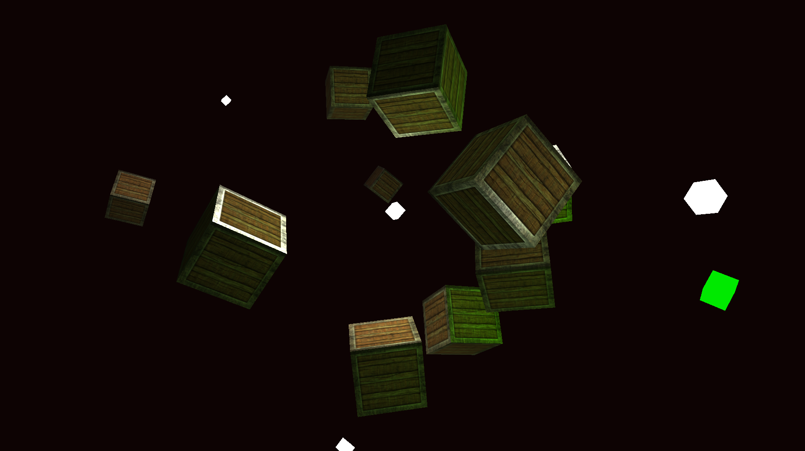
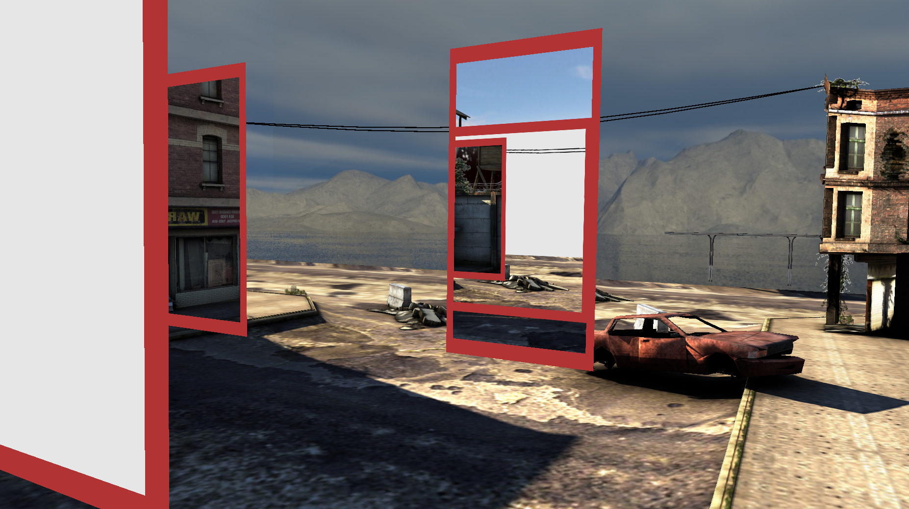
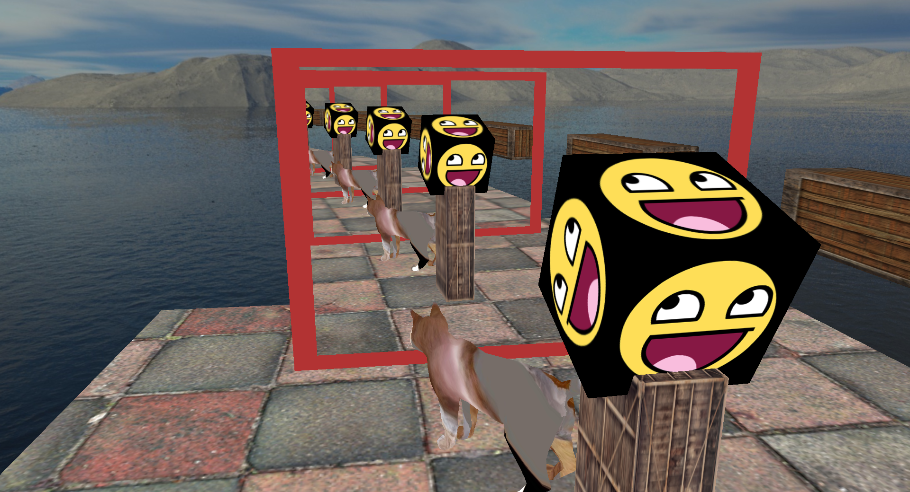

# OpenGLTutorial

Playground for Opengl projects

Based on the tutorial [LearnOpenGL](https://learnopengl.com/)


## Dependencies

You need the following libraries installed:

- **GLFW**
- **Assimp**
- **OpenGL** (system-provided, e.g., via Mesa on Linux)
- **GLAD** (included as source headers)
- A C++ compiler (like `g++`)

## Building

You can build in **debug** or **release** mode using the provided Makefile.

### Debug build

```bash
make debug
```

### Release build

```bash
make release
```

## 🖼️ Examples

### 💡 Lighting


### 🪞 Mirrors


### 🌀 Portals


